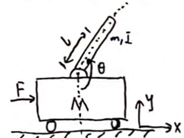
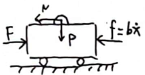
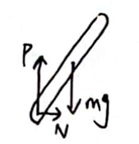
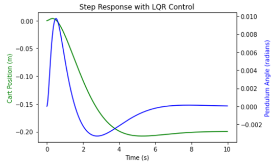
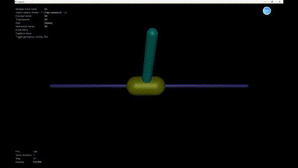

+++
title = 'Control_the_first_order_inverted_pendulum_with_LQR_in_Mujoco_simulation'
date = 2024-12-18T13:21:52-06:00
draft = true
+++
---

## Introduction

The single inverted pendulum (SIP) model describes an unstable dynamic system where a vertical rod (pendulum) is mounted on a cart that can freely move along a horizontal surface. The wheels of the cart are driven by a motor, and by controlling the motor, the cart's motion can be adjusted to balance the rod.



In this system:
- **Input**: Torque applied to the cart's wheels.
- **Output**: Position of the cart and the angle of the rod relative to the vertical.

---

## Notations

| Notation | Definition                                  |
|----------|--------------------------------------------|
| M        | Mass of cart                               |
| m        | Mass of pendulum                           |
| L        | Distance from the center of gravity of pendulum to the joint |
| I        | The moment of inertia of pendulum          |
| b        | Damping coefficient                        |
| u(t)     | External force                             |
| x        | Displacement of cart                       |
| θ        | Angle of pendulum with respect to -y direction |

---

## Force Analysis



From Figure 2, we can derive the following equations:

x-dir:
$$
M\ddot{x} + b\dot{x} + N = F \tag{1}
$$



From Figure 3, we can derive:

x-dir:
$$
N = m \frac{d^2}{dt^2}(x + l\sin\theta) = m\ddot{x} + ml\ddot{\theta}\cos\theta - ml\dot{\theta}^2\sin\theta \tag{2}
$$

y-dir:
$$
P = mg + m \frac{d^2}{dt^2}(l\cos\theta) = mg - ml\ddot{\theta}\sin\theta - ml\dot{\theta}^2\cos\theta \tag{3}
$$

Moment:
$$
I\ddot{\theta} = -P l\sin\theta - N l\cos\theta \tag{4}
$$

---

## ODE

Substituting equation (2) into equation (1), and substituting equations (2), (3) into equation (4) yields:

$$
(M+m)\ddot{x} + b\dot{x} + ml\ddot{\phi}\cos\theta - ml\dot{\theta}^2\sin\theta = F \tag{5}
$$

$$
(I - ml^2\sin^2\theta + ml^2\cos^2\theta)\ddot{\theta} - 2ml^2\sin\theta\cos\theta\dot{\theta}^2 + lm g\sin\theta = -lm\cos\theta\ddot{x} \tag{6}
$$

Linearizing equations (5) and (6) by defining $$\theta = \pi + \phi $$, and assuming $$\phi \to 0 ,  \sin\theta \approx -\phi ,  \cos\theta \approx -1 , \dot{\theta}^2 \approx 0 $$, we get:

$$
(M+m)\ddot{x} + b\dot{x} + ml\ddot{\phi} = F \tag{7}
$$

$$
(I + ml^2)\ddot{\phi} - mgl\phi = ml\ddot{x} \tag{8}
$$

---

## Transfer Function

After applying Laplace transform, we get:

Block math:
$$
\big((M+m)s^2 + bs\big)X(s) + mls^2\Phi(s) = U(s) \tag{9}
$$

Block math:
$$
\big((I + ml^2)s^2 - mgl\big)\Phi(s) = mls^2 X(s) \tag{10}
$$

where \( F = u(t) \). Therefore, the transfer functions are:

Block math:
$$
G_x(s) = \frac{X(s)}{U(s)} = \frac{(I + ml^2)s^2 - mgl}{\big((M+m)(I+ml^2) - m^2l^2\big)s^4 + b(I+ml^2)s^3 - mgl(M+m)s^2 - bmgls}
$$

Block math:
$$
G_\phi(s) = \frac{\Phi(s)}{U(s)} = \frac{mls}{\big((M+m)(I+ml^2) - m^2l^2\big)s^3 + b(I+ml^2)s^2 - mgl(M+m)s - bmgl}
$$

---

## Matrix Form

The state-space representation is defined as:
$$
\vec{x} =
\begin{bmatrix}
x \\
\dot{x} \\
\phi \\
\dot{\phi}
\end{bmatrix}, \quad
\dot{\vec{x}} = A\vec{x} + B\vec{u}, \quad
\vec{y} = C\vec{x} + D\vec{u}
$$
Let $$ p = I(M+m) + Mml^2 $$, the matrices are defined as:

$$
A =
\begin{bmatrix}
0 & 1 & 0 & 0 \\\
0 & -\frac{(I+ml^2)b}{p} & \frac{(m^2g l^2)}{p} & 0 \\\
0 & 0 & 0 & 1 \\\
0 & -\frac{mlb}{p} & \frac{mgl(M+m)}{p} & 0
\end{bmatrix}, \quad
B =
\begin{bmatrix}
0 \\\
\frac{(I+ml^2)}{p} \\\
0 \\\
\frac{ml}{p}
\end{bmatrix}
$$

$$
C =
\begin{bmatrix}
1 & 0 & 0 & 0 \\\
0 & 0 & 1 & 0
\end{bmatrix}, \quad
D =
\begin{bmatrix}
0 \\\
0
\end{bmatrix}
$$


The above matrices can be defined and calculated in Python as follows:

```python
import numpy as np

# System parameters
p = (m + M) * (I + m * L**2) - (m * L)**2

# State-space matrices
A = np.array([[0, 1, 0, 0],
              [0, -(I + m * L**2) * b / p, (m * L)**2 * g / p, 0],
              [0, 0, 0, 1],
              [0, -m * L * b / p, m * g * L * (M + m) / p, 0]])

B = np.array([[0],
              [(I + m * L**2) / p],
              [0],
              [m * L / p]])

C = np.array([[1, 0, 0, 0],
              [0, 0, 1, 0]])

D = np.array([[0],
              [0]])

```
---

## LQR Control

The performance index for the LQR control is given by:

$$
J_{\text{min}} = \int_{0}^{\infty} \big(x^T Q x + u^T R u\big) dt
$$

The control law is defined as:

$$
u = -Kx = -[k_1, k_2, \dots] 
\begin{bmatrix}
x_1 \\\
x_2 \\\
\vdots
\end{bmatrix}
$$

The closed-loop state-space equation becomes:

$$
\dot{\vec{x}} = (A - BK)\vec{x} = A_{\text{cl}} \vec{x}
$$

For this system, the \( Q \) matrix is defined as:

$$
Q =
\begin{bmatrix}
a & 0 & 0 & 0 \\\
0 & b & 0 & 0 \\\
0 & 0 & c & 0 \\\
0 & 0 & 0 & d
\end{bmatrix}
$$

Where:
- Increasing \( a \) increases the weight on the cart's position, leading to faster balance.
- Increasing \( c \) increases the weight on the pendulum's angle, allowing recovery from larger offset angles.
- Increasing \( R \) slows down the balancing process.

Python Code:

The LQR control can be implemented in Python as follows:

```python
# Manually define the Q matrix and set the weights
Q = np.zeros((4, 4))
Q[0, 0] = 1  # Car position weight
Q[2, 2] = 100  # Swing Angle weight
R = 1

# Calculate the LQR feedback gain K
K, _, _ = ctrl.lqr(A, B, Q, R)

# Construct a closed-loop state-space system
Ac = A - B @ K
Bc = B
Cc = C
Dc = D

# Create a closed-loop system
sys_cl = ctrl.ss(Ac, Bc, Cc, Dc)
```
---

## Simulation

Python Code:

```python
# Simulation parameters
M = 0.5  # kg
m = 0.2  # kg
b = 0.1  # N/m/s
g = 9.8  # m/s^2
L = 0.3  # m
I = 0.018  # kg*m^2
t = np.arange(0, 10.01, 0.01)  # Time array
r = 0.2 * np.ones_like(t)  # Reference input

# Feedforward gain Nbar calculation
Cn = np.array([[1, 0, 0, 0]])
sys_ss = ctrl.ss(A, B, Cn, 0)
Nbar = 1.0 / (Cn @ np.linalg.inv(A - B @ K) @ B)

# Simulate closed-loop system response
t, y = ctrl.forced_response(sys_cl, T=t, U=Nbar * r)

# Plot the response
fig, ax1 = plt.subplots()
ax2 = ax1.twinx()
ax1.plot(t, y[0], 'g-', label='Cart Position (m)')
ax2.plot(t, y[1], 'b-', label='Pendulum Angle (radians)')
ax1.set_xlabel('Time (s)')
ax1.set_ylabel('Cart Position (m)', color='g')
ax2.set_ylabel('Pendulum Angle (radians)', color='b')
plt.title('Step Response with LQR Control')
plt.show()
```
We can see the simulation result in Figure 4.



---

## Mujoco Simulation

The Mujoco simulation demonstrates the performance of the LQR control applied to the inverted pendulum system. Below is the Python code to simulate the system in the Mujoco environment:

```python
# Initialize the MuJoCo environment
env = gym.make("InvertedPendulum-v5", render_mode="human")
observation, info = env.reset(seed=42)

# Simulation loop
for _ in range(1000):
    # Get current status
    cart_pos, cart_vel, pole_angle, pole_angular_vel = observation
    state = np.array([cart_pos, cart_vel, pole_angle, pole_angular_vel])
    
    # Computational control input
    u = -K @ state
    u = np.clip(u, env.action_space.low, env.action_space.high)
    
    # Perform the action and get the new state
    observation, reward, done, truncated, info = env.step([u[0]])
    
    # If terminated, reset the environment
    if done or truncated:
        observation, info = env.reset()

env.close()
```

We can see the simulation result in Figure 5.



---

## Reference
https://zhuanlan.zhihu.com/p/54071212?utm_psn=1853238306768289792

